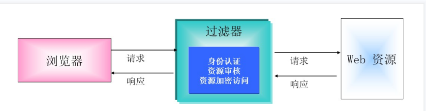
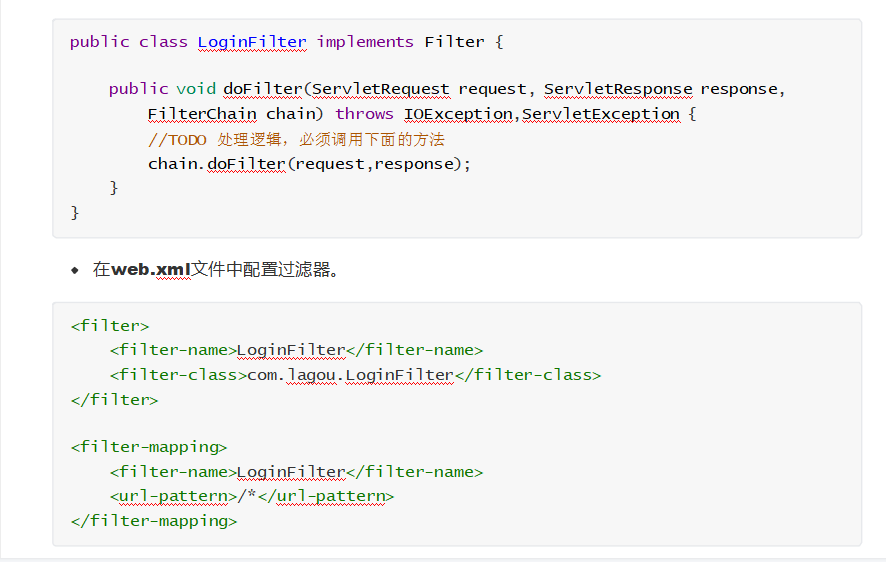
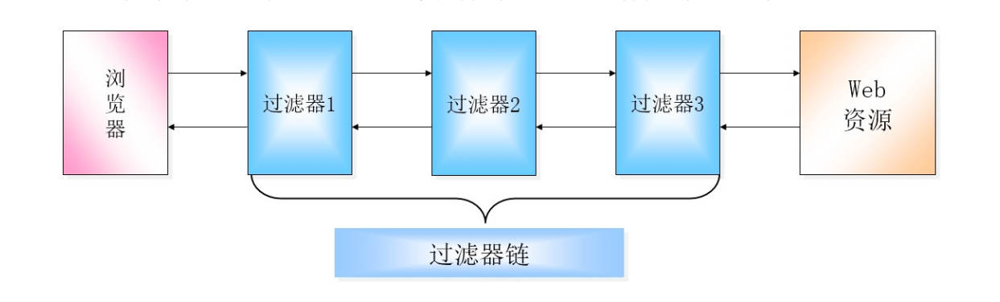

#  **Filter+Listener**核心技术


# **5.1** **Filter**过滤器（重点）


## **5.1.1** **基本概念**

Filter本意为”过滤“的含义，是JavaWeb的三大组件之一，三大组件为：Servlet、Filter、Listener。

过滤器是向 Web 应用程序的请求和响应处理添加功能的 Web 服务组件。

过滤器相当于浏览器与Web资源之间的一道过滤网，在访问资源之前通过一系列的过滤器对请求进行修改、判断以及拦截等，也可以对响应进行修改、判断以及拦截等。

## **5.1.2** **工作方式**




## **5.1.3** **使用方式**

自定义类实现Filter接口并重写doFilter方法，相当于一个拦截机器，如果没有这个代码，相当于直接拦截。

 

## **5.1.4** **Filter**接口

### **（1）** **基本概念**


javax.servlet.Filter接口主要用于描述过滤器对象，可以对资源的请求和资源的响应操作进行筛选   操作。

### **（2）** **常用的方法**

 

| **方法声明**                                                 | **功能介绍**           |
| ------------------------------------------------------------ | ---------------------- |
| void init(FilterConfig filterConfig)                            | 实现过滤器的初始化操作 |
| void doFilter(ServletRequest request, ServletResponse response, FilterChain chain) | 执行过滤操作的功能     |
| void destroy()                                               | 实现过滤器的销毁操作   |

先进行创建，再进行初始化，然后进行过滤，当停止服务器或者重新部署服务器时会启动销毁

## 5.1.5**FilterConfig**接口（进行初始化操作）

### **（1）** **基本概念**

javax.servlet.FilterConfig接口主要用于描述过滤器的配置信息。(在配置文件中进行初始化配置)

### **（2）** **常用方法**

 

| **方法声明**                         | **功能介绍**             |
| ------------------------------------ | ------------------------ |
| String getFilterName()               | 获取过滤器的名字         |
| String getInitParameter(String name) | 获取指定的初始化参数信息 |
| Enumeration getInitParameterNames()  | 获取所有的初始化操作名称 |
| ServletContext getServletContext()   | 获取ServletContext对象   |

## **5.1.6** **多个过滤器的使用**

如果有多个过滤器都满足过滤的条件，则容器依据**映射**的先后顺序来调用各个过滤器。



## **5.1.7** **过滤器优点**

实现代码的“可插拔性”，即增加或减少某个功能模块，不会影响程序的正常执行。

可以将多个相同处理逻辑的模块集中写在过滤器里面，可实现重复利用，提高复用性、也方便代码的维护。

 

# **5.2** **Listener**监听器（重点）

## **5.2.1** **基本概念**

Servlet规范中定义的一种特殊的组件，用来监听Servlet容器产生的事件并进行相应的处理。  -  

容器产生的事件分类如下：

生命周期相关的事件。

属性状态相关的事件。

存值状态相关的事件。

底层原理是采用接口回调的方式实现。

## **5.2.2** **基本分类**

 

| **监听器类型**                                   | **功能介绍**                        |
| ------------------------------------------------ | ----------------------------------- |
| javax.servlet.ServletRequestListener             | 监听request作用域的创建和销毁       |
| javax.servlet.ServletRequestAttributeListener    | 监听request作用域的属性状态变化     |
| javax.servlet.http.HttpSessionListener           | 监听session作用域的创建和销毁       |
| javax.servlet.http.HttpSessionAttributeListener  | 监听session作用域的属性状态变化     |
| javax.servlet.ServletContextListener             | 监听application作用域的创建和销毁   |
| javax.servlet.ServletContextAttributeListener    | 监听application作用域的属性状态变化 |
| javax.servlet.http.HttpSessionBindingListener    | 监听对象与session的绑定和解除       |
| javax.servlet.http.HttpSessionActivationListener | 监听session数值的钝化和活化         |

## **5.2.3** **监听器详解**

### **（1）** **ServletRequestListener**监听器

在ServletRequest创建和关闭时都会通知ServletRequestListener监听器。 常用方法如下：

 

| **方法声明**                                     | **功能介绍**                   |
| ------------------------------------------------ | ------------------------------ |
| void requestInitialized(ServletRequestEvent sre) | 实现ServletRequest对象的初始化 |
| void requestDestroyed(ServletRequestEvent sre)   | 实现ServletRequest对象的销毁   |

### **（2）** **ServletRequestAttributeListener**监听器

向ServletRequest添加、删除或者替换一个属性的时候，将会通知

ServletRequestAttributeListener监听器。常用方法如下：

 

| **方法声明**                                              | **功能介绍**   |
| --------------------------------------------------------- | -------------- |
| void attributeAdded(ServletRequestAttributeEvent srae)    | 增加属性时触发 |
| void attributeReplaced(ServletRequestAttributeEvent srae) | 修改属性时触发 |
| void attributeRemoved(ServletRequestAttributeEvent srae)  | 删除属性时触发 |


### **（3）** **HttpSessionListener**监听器

当一个HttpSession刚被创建或者失效（invalidate）的时候，将会通知HttpSessionListener监听器。

常用方法如下：

 (当浏览器向服务器发送请求时，会创建一个Session对象，并以Cookie的形式进行传输，将Cookie的id返回给Session对象。用Session内置对象，即使关闭浏览器，监听器也不会关闭，因为Session默认的存在时间是30分钟)


可以在配置文件中使用下面的代码设置Session对象的时间：

```
<session-config>
    <session-timeout>3</session-timeout>
</session-config>
```

| **方法声明**                               | **功能介绍**                                                 |
| ------------------------------------------ | ------------------------------------------------------------ |
| void sessionCreated(HttpSessionEvent se)   | 当一个HttpSession对象被创建时会调用这个方法                  |
| void sessionDestroyed(HttpSessionEvent se) | 当一个HttpSession超时或者调用HttpSession的invalidate()方法让它销毁时，将会调用这个方法 |

### **（4）** **HttpSessionAttributeListener**监听器

HttpSession中添加、删除或者替换一个属性的时候，将会通知HttpSessionAttributeListener监       听器。

常用方法如下：

 

| **方法声明**                                       | **功能介绍**                               |
| -------------------------------------------------- | ------------------------------------------ |
| void attributeAdded(HttpSessionBindingEvent se)    | 当往会话中加入一个属性的时候会调用这个方法 |
| void attributeRemoved(HttpSessionBindingEvent se)  | 当从会话中删除一个属性的时候会调用这个方法 |
| void attributeReplaced(HttpSessionBindingEvent se) | 当改变会话中的属性的时候会调用这个方法     |

### **（5）** **ServletContextListener**监听器

t创建和关闭时都会通知ServletContextListener监听器。常用方法如下：

 

| **方法声明**                                     | **功能介绍**                                                 |
| ------------------------------------------------ | ------------------------------------------------------------ |
| void contextInitialized(ServletContextEvent sce) | 当ServletContext创建的时候，将会调用这个方法                 |
| void contextDestroyed(ServletContextEvent sce)   | 当ServletContext销毁的时候（例如关闭应用服务器或者重新加载应用），将会调用这个方法 |

### **（6）** **ServletContextAttributeListener**监听器

向ServletContext添加、删除或者替换一个属性的时候，将会通知

![img]ServletContextAttributesListener监听器常用方法如下：


| **方法声明**                                              | **功能介绍**                             |
| --------------------------------------------------------- | ---------------------------------------- |
| void attributeAdded(ServletContextAttributeEvent scae)    | 往ServletContext中加入一个属性的时候触发 |
| void attributeRemoved(ServletContextAttributeEvent scae)  | 从ServletContext中删除一个属性的时候触发 |
| void attributeReplaced(ServletContextAttributeEvent scae) | 改变ServletContext中属性的时候触发       |

 

### **（7）** **HttpSessionBindingListener**监听器（监听器不需要配置）

HttpSession中绑定和解除绑定时，将会通知HttpSessionListener监听器。    常用方法如下：

只要有一个自己创建的对象和Session之间进行了绑定和解除时候通知监听器。

要创建类

 

| **方法声明**                                     | **功能介绍**               |
| ------------------------------------------------ | -------------------------- |
| void valueBound(HttpSessionBindingEvent event)   | 有对象绑定时调用该方法     |
| void valueUnbound(HttpSessionBindingEvent event) | 有对象解除绑定时调用该方法 |

### **（8）** **HttpSessionActivationListener**监听器

当有session数值的钝化和活化操作时，将会通知HttpSessionActivationListener监听器。      常用方法如下：

 钝化：序列化操作：将一个对象所有相关的数据内容转换为字节序列的过程，最后写入硬盘中一直存在

活化：从硬盘拿出来放回内存中

| **方法声明**                                   | **功能介绍**           |
| ---------------------------------------------- | ---------------------- |
| void sessionWillPassivate(HttpSessionEvent se) | 有钝化操作时调用该方法 |
| void sessionDidActivate(HttpSessionEvent se)   | 有活化操作时调用该方法 |

配置context.xml文件的方式如下：(将数据保存在了C盘下的session中)

```
<Manager className="org.apache.catalina.session.PersistentManager" saveOnRestart="true">
<!-- 配置文件存放的路径信息，可以自由指定 -->
<Store className="org.apache.catalina.session.FileStore" directory="C:\session"/>
</Manager>
```

## **5.2.4** **实战案例**

自定义类实现监听器接口并重写相关的方法。

```
public class OnlineUser implements HttpSessionListener,ServletContextListener { ServletContext ctx = null;

// 初始化ServletContext
public void contextInitialized(ServletContextEvent e) { ctx = e.getServletContext();
}
// 销毁ServletContext
public void contextDestroyed(ServletContextEvent e) {
//将ServletContext设置成null;
  }
// 当新创建一个HttpSession对象时
public void sessionCreated(HttpSessionEvent e) {
//将当前的在线人数加上1，并且保存到ServletContext(application)中
}
// 当一个HttpSession被销毁时（过期或者调用了invalidate()方法）
public void sessionDestroyed(HttpSessionEvent e) {
//将当前人数减去1，并且保存到ServletContext(application)中
   }
}
```

在web.xml中配置监听器

```
<listener>
<listener-class> com.lagou.listener.OnlineUser </listener-class>
</listener>
```

 