# JSP核心技术


## **1.1** **JSP**的概述（熟悉

### 1.1.1 **JSP**的概念

JSP是Java Server Pages的简称，跟Servlet一样可以动态生成HTML响应， JSP文件命名为xxx.jsp。

与Servlet不同，JSP文件以HTML标记为主，然后内嵌Java代码段，用于处理动态内容。（Servlet里面主要以Java代码为主，内嵌HTML文件）

### **1.1.2** **JSP**的示例

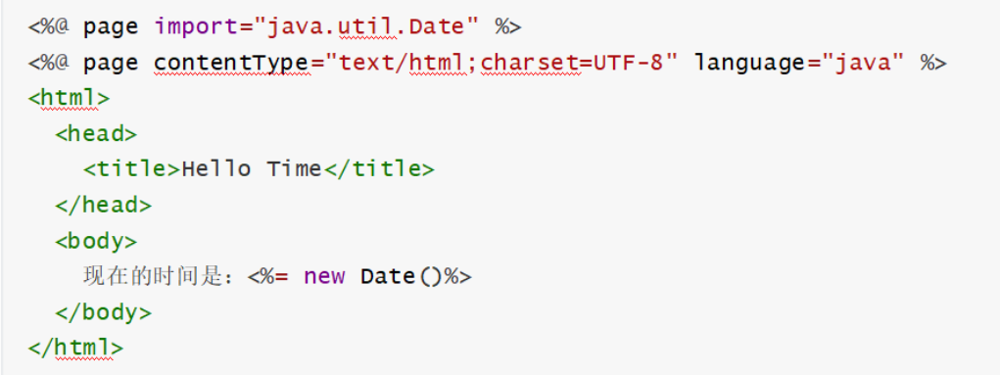

### **1.1.3** **JSP**与****Servlet****的关系


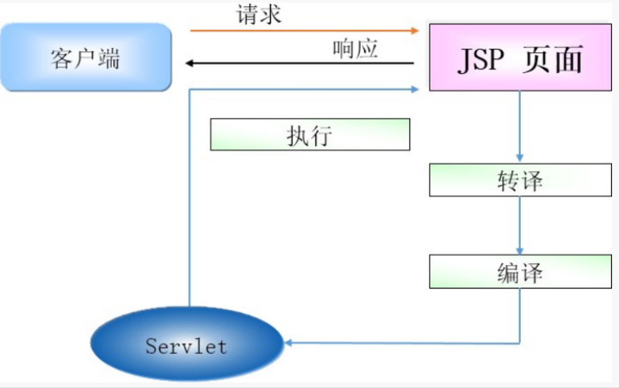 

## **1.2** **JSP**的语法（熟悉）


### **1.2.1** **JSP**语法结构

声明区

程序代码区表达式

注释

指令和动作内置对象

### **1.2.2** **声明区**

基本语法：

<%! %>

说明：可以定义全局变量、方法、类。


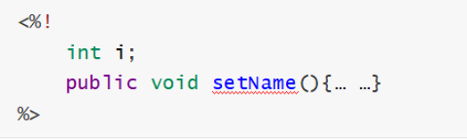 

### 1.2.3 **程序代码区**

基本语法：

<%程序代码区%>

说明：可以定义局部变量以及放入任何的Java程序代码。


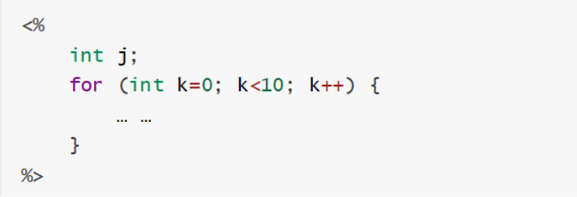 


### **1.2.4** **表达式**

基本语法：

<%=… …%>

说明：可以输出一个变量或一个具体内容，但=后面必须是字符串变量或者可以被转换成字符串的  表达式。

注意：**不需要以;结束，只有一行**


 


 

案例题目

 

 

| id   | name | age  | salary |
| ---- | ---- | ---- | ------ |
| 1    | 1    | 1    | 1      |
| 2    | 2    | 2    | 2      |
| ...  |      |      |        |
| 5    | 5    | 5    | 5      |


### **1.2.5** **注释**


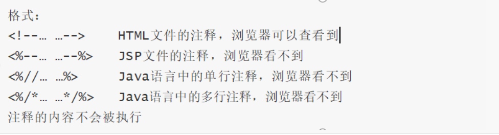 


 

### **1.2.6** **指令和动作**

指令格式：

<%@指令 属性=“属性值”%> 指令的属性可以设定多个。

JSP常用指令有：page、taglib、include。

### **（1）** **page**指令

page指令用于导包和设置一些页面属性，常用属性如下：


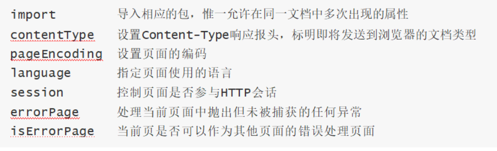 


 

### **（2）** **taglib**指令

taglib指令用来扩展JSP程序的标签元素，引入其他功能的标签库文件。


 


 

### **（3）** **include**指令

include指令用于引入另一个JSP程序或HTML文件等，格式如下：


 

JSP引擎会在JSP文件的转换时期先把file属性设定的文件包含进来，然后开始执行转换及编译的工  作。

### **（4）** **jsp:include/jsp:param**

**jsp:include动作用于引入另一个JSP程序或HTML文件等**。

执行到include时，被include的文件才会被编译。

如果include的是jsp文件，那它不会被转换成Servlet文件。

**jsp:parm：是用来设置值**


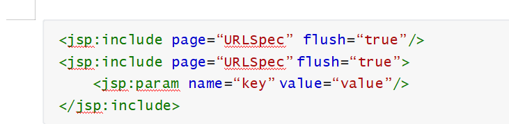

 

### **（5）** **include**指令和****include****动作的区别

include指令是在JSP程序的转换时期就将file属性所指定的程序内容嵌入再编译执行（静态包含）。（就是先包含再编译）

include动作在转换时期是不会被编译的，只有在客户端请求时期被执行到才会被动态的编译载入

（动态包含，推荐）。（先编译，再包含）

### **（6）** **jsp:forward/jsp:param**

**forward动作用于在JSP中实现转发**，将请求转发到另一个指定的JSP程序或者Servlet中处理。（服务器内部跳转，地址不会变） 也就是去执行另一个jsp或者是页面。


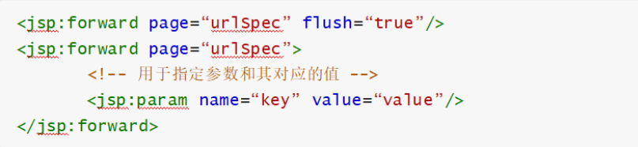

## **1.3 **JSP内置对象（重点）


### **1.3.1** **基本概念**

在JSP程序中有9个内置对象由容器为用户进行实例化，程序员可以不用定义就直接使用这些变量。

  在JSP转换成Servlet后，会自动追加这些变量的定义，使用内置对象可以简化JSP的开发。

### **1.3.2** **对象名称**

 

| **对象变量** | **对象类型**        | **作用**         |
| ------------ | ------------------- | ---------------- |
| out          | JSPWriter           | 输出流           |
| request      | HttpServletRequest  | 请求信息         |
| response     | HttpServletResponse | 响应信息         |
| session      | HttpSession         | 会话             |
| application  | ServletContext      | 全局的上下文对象 |
| pageContext  | PageContext         | JSP页面上下文    |
| page         | Object              | JSP页面本身      |
| config        | ServletConfig        | Servlet配置对象  |
| exception    | Throwable           | 捕获网页异常     |

### **1.3.3** **out**内置对象

t内置对象是一个缓冲的输出流，用来给客户端输出信息。

常用方法如下：

| **方法声明**           | **功能介绍**                               |
| ---------------------- | ------------------------------------------ |
| void println(String x) | 向客户端输出各种类型数据                   |
| void newLine()         | 输出一个换行符                             |
| void close()           | 关闭输出流                                 |
| int getBufferSize()     | 返回缓冲区的大小                           |
| int getRemaining()     | 返回缓冲区中未使用的字节数                 |
| void flush()            | 输出缓冲区里的数据                         |
| void clearBuffer()      | 清除缓冲区里的数据，同时把数据输出到客户端 |
| void clear()           | 清除缓冲区里的数据，但不把数据输出到客户端 |

### **1.3.4** **request**内置对象

request对象封装的是调用JSP页面的请求信息，它是HttpServletRequest接口的一个实例。

**该对象的属性值只在一个请求中保存。**

)常用方法如下：

 

| **方法声明**                              | **功能介绍**                                   |
| ----------------------------------------- | ---------------------------------------------- |
| String getMethod()                        | 返回客户端向服务器端传送数据的方式             |
| String getParameter(String name)          | 返回客户端向服务器端传送的参数值               |
| String[] getParameterValues( String name) | 获得指定参数的所有值                           |
| String getRequestURI()                    | 获得请求地址                                   |
| String getRemoteAddr()                    | 返回发送请求的客户端或最后一个代理的IP地址     |
| int getRemotePort()                       | 返回发送请求的客户端或最后一个代理的端口号     |
| String getServerName()                    | 获取服务器的名字                               |
| int getServerPort()                       | 获取服务器端的端口                             |
| void setAttribute(String name,Object o)   | 在此请求中存储属性。属性在请求之间重置         |
| Object getAttribute(String name)          | 将指定属性的值作为对象返回，若不存在则返回空值 |

注意区别：getAttribute()表示从request范围取得设置的属性，必须要通过setAttribute设置属性，才能通过getAttribute取得。设置和取得的值都是Object类型。

​    getParameter()表示接收页面提交的 参数，主要有表单提交的参数、URL重写传递的参数（http://item.jsp?id=1中的id值）等，所以不需要通过setParameter来设置参数，而且参数的返回类型是String类型。

### 1.3.5 **response**内置对象

response对象用于给客户端相应输出处理结果，它是HttpServletResponse接口的一个实例。

 经常用于设置HTTP标题，添加cookie、设置响应内容的类型和状态、发送HTTP重定向和编码URL。

常用方法如下：


| **方法声明**                              | **功能介绍**                                    |
| ----------------------------------------- | ----------------------------------------------- |
| void addCookie(Cookie cookie)             | 添加一个Cookie对象，用于在客户端保存特定的信 息 |
| void addHeader(String name, String value) | 添加HTTP头信息，该Header信息将发送到客户端      |
| boolean containsHeader(String name)       | 判断指定名字的HTTP文件头是否存在                |
| void sendRedirect(String location)        | 重定向JSP文件                                   |
| void setContentType(String type)          | 设置类型与编码方式                              |

 

### **1.3.6** **session**内置对象

session对象表示浏览器和服务器之间的一次会话，一次会话可以包含多次请求，在多次请求之间    可以借助session对象存储信息，它是HttpSession类型的一个实例。

**该对象的属性值在一次会话范围中保存，保存在服务器端，只要不关闭浏览器，默认半个小时内都  可以访问。（如果浏览器关闭了，重新打开，获取到的值为null）**

常用方法如下：

 

| **方法声明**                                 | **功能介绍**                                                 |
| -------------------------------------------- | ------------------------------------------------------------ |
| void setAttribute(String name, Object value) | 使用指定的名称将对象绑定到此会话                             |
| Object getAttribute(String name)             | 返回在此会话中用指定名称绑定的对象，如果没有对象在该名称下绑定则返回空值 |

### **1.3.7** **application**内置对象

application对象是一个web程序的全局变量，它是ServletContext类型的一个实例。

在整个服务器上保存数据，所有用户共享。(多个浏览器之间共享，而session不可以)

Session对象和Application对象

1、对象不同。Application用于保存所有用户的公共数据信息，Session用于保存每个用户的专用信息；

2、信息量大小不同。Application适用于任何大小的数据，Session只适用于少量、简单的数据；

3、保存时间不同。Application保存期贯穿于整个应用程序的生命期，Session保存期一般是用户活动时间+一段延迟时间，大多数情况下为20分钟；

常用方法如下：

 

| **方法声明**                                  | **功能介绍**                                               |
| --------------------------------------------- | ---------------------------------------------------------- |
| void setAttribute(String name, Object object) | 将对象绑定到此servlet上下文中的给定属性名                  |
| Object getAttribute(String name)              | 返回给定名称的servlet容器属性，若没有该名称的属 性返回null |

### **1.3.8** **pageContext**内置对象

pageContext对象是PageContext类型的对象，可以使用这个对象来管理其他的隐含对象。

只在一个页面中保存数据。(转发也不行)


| **方法声明**                                            | **功能介绍**                                       |
| ------------------------------------------------------- | -------------------------------------------------- |
| void setAttribute(String name, Object value, int scope) | 使用适当的作用域设置指定的名称和值                 |
| Object getAttribute(String name, int scope)             | 返回指定作用域中名称关联的对象，若找不到则返回null |
| ServletRequest getRequest()                             | 获取请求对象                                       |
| ServletResponse getResponse()                           | 获取响应对象                                       |
| HttpSession getSession()                                | 获取会话对象                                       |
| ServletConfig getServletConfig()                          | 获取配置对象                                       |
| JspWriter getOut()                                      | 获取输出对象                                       |
| Object getPage()                                        | 获取页面对象                                       |
| Exception getException()                                | 获取异常对象                                       |


例如：

```
<a href="${pageContext.request.contextPath}/test?methodName=addCourse">新建课程</a>
```

在页面中点击新建课程，就会执行addCourse方法。

###  1.3.9Exception内置对象

exception 对象是Throwable的实例，表示的是JSP的异常信息。

如果要使用它，必须将对应页面page指令的isErrorPage属性设置成true。

单个页面的处理方式

 在web.xml中配置统一的异常处理页面。

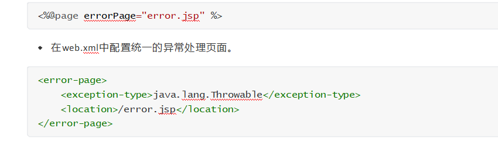

##  **1.4 **JavaBean组件（熟悉）


### **（1）** **基本概念**

JavaBean 是使用 Java 语言开发的一个可重用的组件，在 JSP 开发中可以使用 JavaBean 减少重复代码，使整个 JSP 代码的开发更加简洁。

JavaBean本质上就是Java类，通常要求如下：

属性：全部私有化，通过get和set方法进行访问。

方法：必须是public关键字修饰。

构造器 ：必须有无参构造方法。

### **（2）** **使用方式**

使用jsp:useBean的方式创建javaBean实例


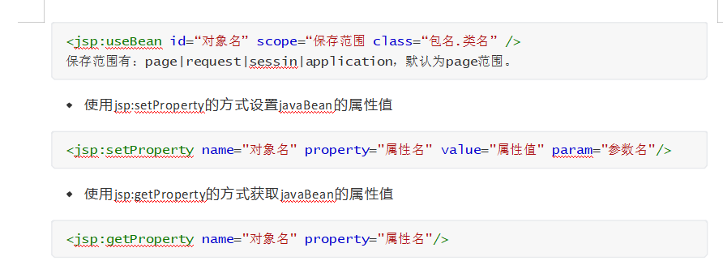

 

使用jsp:setProperty的方式设置javaBean的属性值

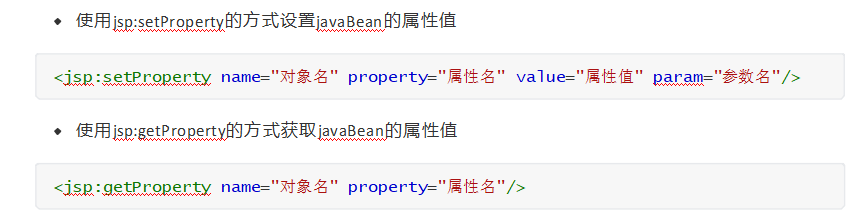

使用jsp:getProperty的方式获取javaBean的属性值

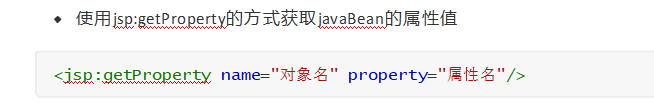

### **（3）** **保存范围**

JavaBean的保存范围有page、request、session以及application，默认是page范围。

### **（4）** **删除方式**


 


##  **1.5 **MVC设计模式（重点）


**1.5.1** **基本概念**

MVC是模型(Model)和视图(View)以及控制器(Controller)的简写，是一种将数据、界面显示和业务逻辑进行分离的组织方式，这样在改进界面及用户交互时，不需要重新编写业务逻辑，从而提高了  代码的可维护性。

M：主要用于封装业务数据的JavaBean(Bean) 和 业务逻辑的JavaBean(Service)及访问数据库的

DAO对象。

V：主要负责数据收集  和  数据展现，通常由JSP文件完成。

C：主要负责流程控制 和 页面跳转，通常由Servlet完成。


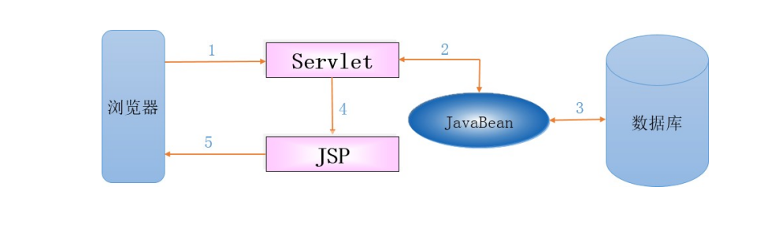 