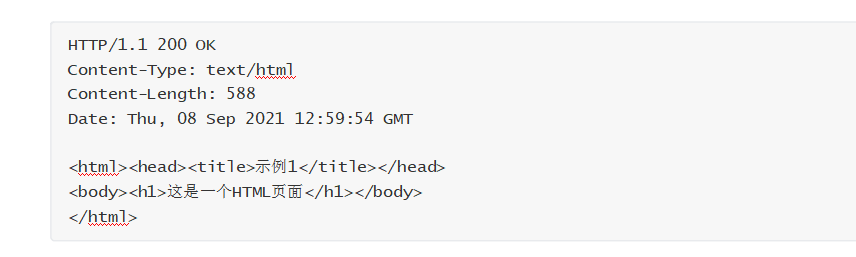
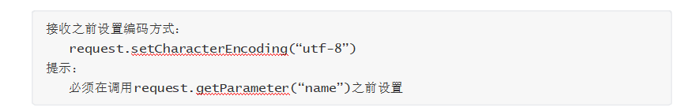

# **第一章** **Servlet**核心技术（上）


# **1.1** **基本概念（常识）**


## **1.1.1** **C/S**架构的概念

C/S架构（Client/Server，客户端/服务器模式），是一种比较早的软件体系结构，也是生活中很常见的结构。这种结构将需要处理的业务合理地分配到客户端和服务器端，客户端通常负责完成与用  户的交互任务，服务器通常负责数据的管理。

C/S架构的主要优点如下：

客户端的界面和功能可以很丰富。应用服务器的负荷较轻。

响应速度较快。

C/S架构的主要缺点如下：

适用面窄，用户群固定。

维护和升级的成本高，所有的客户端都需要更新版本。

## **1.1.2** **B/S**架构的概念

B/S架构（Browser/Server，浏览器/服务器模式），是互联网兴起后的软件体系结构，该结构将系统功能实现的主要业务逻辑集中到服务器端，极少数业务逻辑在浏览器实现，浏览器通常负责完  成与用户的交互任务，服务器通常负责数据的管理。

B/S架构的主要优点如下：

无需安装客户端，只要有浏览器即可。适用面广，用户群不固定。

通过权限控制实现多客户访问的目的，交互性较强。维护和升级的成本低，无需更新所有客户端版本。

B/S架构的主要缺点如下：

应用服务器的负荷较重。

浏览器的界面和功能想要达到客户端的丰富程度需要花费大量的成本。在跨浏览器上不尽如人意，适配比较麻烦。

## **1.1.3** **JavaWeb**的概念

Web本意为网页的含义，这里表示互联网上供外界访问的资源。 互联网上供外界访问的资源主要分为以下两种：

静态资源：主要指Web页面中供人们浏览的数据始终是不变。

动态资源：主要指Web页面中供人们浏览的数据由程序产生，不同时间点访问页面看到的内  容各不相同。

JavaWeb主要指使用Java语言进行动态Web资源开发技术的统称，是解决相关Web互联网领域的技     术总和。

早期的B/S架构


 

后来的B/S架构


 


 

# **1.2** **HTTP**协议（熟悉）


## **1.2.1** **HTTP**协议的概念

HTTP协议（HyperText  Transfer  Protocol，超文本传输协议）是由W3C（万维网联盟）组织制定的一种应用层协议，是用来规范浏览器与Web服务器之间如何通讯的数据格式，主要涉及浏览器   的发请求格式和服务器的响应格式。

HTTP协议通常承载于TCP协议之上，而承载于TLS或SSL协议层之上的协议就是常说的HTTPS协议。


HTTP默认的端口号为80，HTTPS默认的端口号为443。


## **1.2.2** **HTTP**请求格式

客户端发送一个HTTP请求到服务器的请求消息主要包括：请求行、请求头、空白行和请求体。


 

举例如下：


 


 

## **1.2.3** **HTTP**响应格式

通常情况下服务器接收并处理客户端发过来的请求后会返回一个HTTP的响应消息，主要包括：响   应行、响应头、空白行和响应体。


 


 举例如下：



 


 

 

# **1.3** **Tomcat****服务器（重点）


## **1.3.1** **基本概念**

Tomcat本意为公猫的含义，最初是由Sun公司的软件架构师詹姆斯·邓肯·戴维森开发的，后来他帮     助将其变为开源项目并由Sun公司贡献给Apache软件基金会。

Tomcat      服务器是一个开源的轻量级Web应用服务器，在中小型系统和并发量小的场合下被普遍使用，是开发和调试Servlet、JSP 程序的首选。


## **1.3.2** **安装方式**


下载地址：

<http://tomcat.apache.org/>


## **1.3.3** **目录结构**

bin	主要存放二进制可执行文件和脚本。

conf	主要存放各种配置文件。

lib	主要用来存放Tomcat运行需要加载的jar包。 

 logs	主要存放Tomcat在运行过程中产生的日志文件。temp	主要存放Tomcat在运行过程中产生的临时文件。

webapps	主要存放应用程序，当Tomcat启动时会去加载该目录下的应用程序。

work	主要存放tomcat在运行时的编译后文件，例如JSP编译后的文件。

## **1.3.4** **启动和关闭**

启动方式

使用bin目录下的批处理文件startup.bat来启动Tomcat服务器，若出现一个毫秒数说明启动成功。

关闭方式

使用bin目录下的批处理文件shutdown.bat来关闭Tomcat服务器。注意事项

启动之前首先安装JDK并配置环境变量JAVA_HOME，若希望Tomcat服务器可以在任意路径启动， 则需要配置环境变量CATALINA_HOME。

启动信息乱码的处理方式：logging.properties文件修改为

java.util.logging.ConsoleHandler.encoding = GBK

## **1.3.5** **配置文件**

server.xml文件是服务器的主配置文件，可以设置端口号、设置域名或IP、默认加载的项目、请求     编码等。


 


tomcat-users.xml文件用来配置管理Tomcat服务器的用户与权限 。


 


 

 

# **1.4** **Servlet**的概念和使用（重点）


## **1.4.1** **基本概念**

Servlet（Server Applet）是Java Servlet的简称，称为小服务程序或服务连接器，是Java语言编写的服务器端程序，换句话说，Servlet就是运行在服务器上的Java类。

Servlet用来完成B/S架构下客户端请求的响应处理，也就是交互式地浏览和生成数据，生成动态Web内容。

## **1.4.2** **Servlet**的编程步骤

建立一个Java Web Application项目并配置Tomcat服务器。

自定义类实现Servlet接口或继承 HttpServlet类（推荐） 并重写service方法。

将自定义类的信息配置到 web.xml文件并启动项目，配置方式如下：


 **注意：**

 在Servlet中,设置了@WebServlet注解,当请求该Servlet时,服务器就会自动读取当中的信息,如果注解@WebServlet("/category"),则表示该Servlet默认的请求路径为…/category,这里省略了urlPatterns属性名,完整的写法应该是:@WebServlet(urlPatterns = “/category”),如果在@WebServlet中需要设置多个属性,必须给属性值加上属性名称,中间用逗号隔开,否则会报错.
若没有设置@WebServlet的name属性，默认值会是Servlet的类完整名称.


## **1.4.3** **Servlet**接口

### **（1）** **基本概念**

javax.servlet.Servlet接口用于定义所有servlet必须实现的方法。

### **（2）** **常用的方法**


| **方法声明**                                          | **功能介绍**                                                |
| ----------------------------------------------------- | ----------------------------------------------------------- |
| void init(ServletConfig config)                         | 由servlet容器调用，以向servlet指示servlet正在被放入服务中   |
| void service(ServletRequest req, ServletResponse res) | 由servlet容器调用，以允许servlet响应请求                    |
| ServletConfig getServletConfig()                        | 返回ServletConfig对象，该对象包含此servlet的初始化和启动参数 |
| String getServletInfo()                               | 返回有关servlet的信息，如作者、版本和版权                   |
| void destroy()                                        | 由servlet容器调用，以向servlet指示该servlet正在退出服务     |

 

## **1.4.4 **GenericServlet类

### **（1）** **基本概念**

javax.servlet.GenericServlet类主要用于定义一个通用的、与协议无关的servlet，该类实现了Servlet接口。

若编写通用servlet，只需重写service抽象方法即可。

### **（2）** **常用的方法**

 

| **方法声明**                                                 | **功能介绍**                         |
| ------------------------------------------------------------ | ------------------------------------ |
| abstract void service(ServletRequest req, ServletResponse res) | 由servlet容器调用允许servlet响应请求 |

## **1.4.5 **HttpServlet类

### **（1）** **基本概念**

javax.servlet.http.HttpServlet类是个抽象类并继承了GenericServlet类。     用于创建适用于网站的HTTP Servlet，该类的子类必须至少重写一个方法。

### **（2）** **常用的方法**

 

| **方法声明**                                                 | **功能介绍**                        |
| ------------------------------------------------------------ | ----------------------------------- |
| void doGet(HttpServletRequest req, HttpServletResponse resp) | 处理客户端的GET请求                 |
| void doPost(HttpServletRequest req, HttpServletResponse resp) | 处理客户端的POST请求                |
| void init()                                                  | 进行初始化操作                      |
| void service(HttpServletRequest req, HttpServletResponse resp) | 根据请求决定调用doGet还是doPost方法 |
| void destroy()                                               | 删除实例时释放资源                  |

补充 ：

```
equalsIgnoreCase  用于字符串之间的比较，不考虑大小写
```

## **1.4.6**Servlet**的生命周期**


 


构造方法只被调用一次，当第一次请求Servlet时调用构造方法来创建Servlet的实例。

init方法只被调用一次，当创建好Servlet实例后立即调用该方法实现Servlet的初始化。

service方法被多次调用，每当有请求时都会调用service方法来用于请求的响应。

destroy方法只被调用一次，当该Servlet实例所在的Web应用被卸载前调用该方法来释放当前占用的资源。

 

# **1.5** **POST**和****GET****请求（重点）


## **1.5.1** *GET*请求


 


 

## **1.5.2** **POST**请求


 


 

## **1.5.3** **ServletRequest**接口

### **（1）** **基本概念**

javax.servlet.ServletRequest接口主要用于向servlet提供客户端请求信息，可以从中获取到任何 请求信息。

Servlet容器创建一个ServletRequest对象，并将其作为参数传递给Servlet的service方法。

### **（2）** **常用的方法**


| **方法声明**                              | **功能介绍**                                                 |
| ----------------------------------------- | ------------------------------------------------------------ |
| String getParameter(String name)          | 以字符串形式返回请求参数的值，如果该参数不存在，则返回空值   |
| String[] getParameterValues( String name) | 返回一个字符串对象数组，其中包含给定请求参数所具有的所有值，如果该参数不存在，则返回空值 |
| Enumeration getParameterNames()           | 返回包含此请求中包含的参数名称的字符串对象的枚举。如果请求没有参数，则方法返回空枚举 |
| Map<String, String[]> getParameterMap()   | 返回请求参数的键值对，一个键可以对应多个值                   |
| String getRemoteAddr()                    | 返回发送请求的客户端或最后一个代理的IP地址                   |
| int getRemotePort()                       | 返回发送请求的客户端或最后一个代理的端口号                   |

 代码：

```java
    request.setCharacterEncoding("utf-8");
// 1.获取指定参数名称对应的参数值并打印
        String name = request.getParameter("name");
        System.out.println("获取到的姓名为：" + name);
        String[] hobbies = request.getParameterValues("hobby");
        System.out.print("获取到的爱好有：");
        for (String ts : hobbies) {
            System.out.print(ts + " ");
        }
        System.out.println();

        System.out.println("-------------------------------------------------------");
        // 2.获取所有参数的名称
        Enumeration<String> parameterNames = request.getParameterNames();
        System.out.print("获取到的所有参数名称为：");
        while (parameterNames.hasMoreElements()) {
            System.out.print(parameterNames.nextElement() + " ");
        }
        System.out.println();

        System.out.println("-------------------------------------------------------");

        //3.获取请求参数名和对应值得第二种方式
        Map<String, String[]> parameterMap = request.getParameterMap();
        //将Map集合中得所有键值对组成Set集合
        Set<Map.Entry<String, String[]>> entries = parameterMap.entrySet();
        //遍历Set集合
        for(Map.Entry<String , String[]> me : entries){
            System.out.println(me.getKey() + "对应的数值有" );
            for(String ts : me.getValue()){
                System.out.println(ts + " ");
            }
            System.out.println();
        }
```

## **1.5.4** **HttpServletRequest**接口

### **（1）** **基本概念**

javax.servlet.http.HttpServletRequest接口是ServletRequest接口的子接口，主要用于提供HTTP

请求信息的功能。

不同于表单数据，在发送HTTP请求时，HTTP请求头直接由浏览器设置。

可直接通过HttpServletRequest对象提供的一系列get方法获取请求头数据。

### **（2）** **常用的方法**

 

| **方法声明**                | **功能介绍**                                  |
| --------------------------- | --------------------------------------------- |
| String getRequestURI()      | 返回此请求的资源路径信息                      |
| StringBuffer getRequestURL() | 返回此请求的完整路径信息                      |
| String getMethod()          | 返回发出此请求的HTTP方法的名称，例如GET、POST |
| String getQueryString()     | 返回路径后面请求中附带的参数                  |
| String getServletPath()     | 返回此请求中调用servlet的路径部分             |

代码：

```java
System.out.println("发送请求客户端的IP地址为：" + request.getRemoteAddr());
System.out.println("发送请求客户端的端口号为:" + request.getRemotePort());
System.out.println("请求资源的路径为：" + request.getRequestURI());
System.out.println("请求资源的完整路径为：" + request.getRequestURL());
System.out.println("请求方式为：" + request.getMethod());
System.out.println("请求附带参数为" + request.getQueryString());
System.out.println("请求的Servlet路径为" + request.getServletPath());
```

## **1.5.5** **ServletResponse**接口

### **（1）** **基本概念**

javax.servlet.ServletResponse接口用于定义一个对象来帮助Servlet向客户端发送响应。Servlet容器创建ServletResponse对象，并将其作为参数传递给servlet的service方法。

### **（2）** **常用方法**


| **方法声明**                     | **功能介绍**                                                 |
| -------------------------------- | ------------------------------------------------------------ |
| PrintWriter getWriter()          | 返回可向客户端发送字符文本的PrintWriter对象                  |
| String getCharacterEncoding()    | 获取响应内容的编码方式                                       |
| void setContentType(String type) | 如果尚未提交响应，则设置发送到客户端响应的内容类型。内容类型可以包括字符编码规范，例如text/html;charset=UTF-8 |

 代码如下：

```java
向浏览器发送响应数据
//获取响应数据默认编码方式
String characterEncoding = response.getCharacterEncoding();
System.out.println("服务器响应数据的默认编码方式为："  + characterEncoding);

//设置服务器和浏览器的编码方式和文本类型
response.setContentType("text/html;charset = UTF-8");

PrintWriter writer = response.getWriter();
//writer.write("hello");
Random ra = new Random();
int i = ra.nextInt(100) + 1;
writer.write("<h1>" + i + "<h1>");
System.out.println("服务器传送成功");
writer.close();
```

## **1.5.6** **HttpServletResponse**接口

### **（1）** **基本概念**

javax.servlet.http.HttpServletResponse接口继承ServletResponse接口，以便在发送响应时提供       特定于HTTP的功能。

### **（2）** **常用的方法**

 

| **方法声明**                       | **功能介绍**                                      |
| ---------------------------------- | ------------------------------------------------- |
| void sendRedirect(String location) | 使用指定的重定向位置URL向客户端发送临时重定向响应 |

## **1.5.7** **使用示例**


 


 

案例题目

使用Servlet获取在服务器获取一个1~100之间的随机数并发送给客户端进行显示。

 

## **1.6** **Servlet**接收中文乱码（重点）


### **1.6.1** **接收乱码原因**

浏览器在提交表单时，会对中文参数值进行自动编码。当Tomcat服务器接收到浏览器请求后自动    解码，当编码与解码方式不一致时,就会导致乱码。


### **1.6.2** **解决**POST****接收乱码


 


 

### **1.6.3** **解决**GET****接收乱码


 


 

 

## **1.7** **ServletConfig**接口（熟悉）


### **（1）** **基本概念**

javax.servlet.ServletConfig接口用于描述Servlet本身的相关配置信息，在初始化期间用于将信息 传递给Servlet配置对象。

### **（2）** **配置方式**


 


 

### **（3）** **常用的方法**

 

| **方法声明**                         | **功能介绍**                                                 |
| ------------------------------------ | ------------------------------------------------------------ |
| String getServletName()              | 返回Servlet的别名                                            |
| String getInitParameter(String name) | 返回包含初始化参数值的字符串，如果该参数不存在，则返回null   |
| Enumeration getInitParameterNames()  | 将servlet的初始化参数的名称作为字符串对象的枚举返回，如果servlet没有初始化参数，则返回空枚举 |
| ServletContext getServletContext()   | 返回对调用方正在其中执行的ServletContext的引用               |


## **1.8** **ServletContext**接口（熟悉）


### **（1）** **基本概念**

javax.servlet.ServletContext接口主要用于定义一组方法，Servlet使用这些方法与它的Servlet容器通信。

服务器容器在启动时会为每个项目创建唯一的一个ServletContext对象，用于实现多个Servlet之间的信息共享和通信。

在Servlet中通过this.getServletContext()方法可以获得ServletContext对象。

### **（2）** **配置方式**


 


 

### **（3）** **常用的方法**

 

| **方法声明**                                  | **功能介绍**                                                 |
| --------------------------------------------- | ------------------------------------------------------------ |
| String getInitParameter(String name)          | 返回包含初始化参数值的字符串，如果该参数不存在，则返回null   |
| Enumeration getInitParameterNames()           | 将servlet的初始化参数的名称作为字符串对象的枚举返回，如 果servlet没有初始化参数，则返回空枚举 |
| String getRealPath(String path)               | 返回包含给定虚拟路径的实际路径的字符串                       |
| String getContextPath()                       | 返回与此上下文关联的主路径                                   |
| InputStream getResourceAsStream(String path)  | 将位于指定路径的资源作为InputStream对象返回                  |
| void setAttribute(String name, Object object) | 将指定的属性名和属性值绑定到当前对象                         |
| Object getAttribute(String name)              | 根据执行的属性名获取属性值                                   |
| void removeAttribute(String name)             | 删除指定的属性名信息                                         |

 