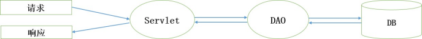
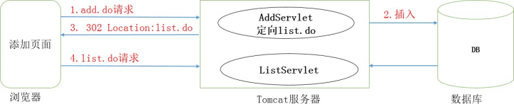
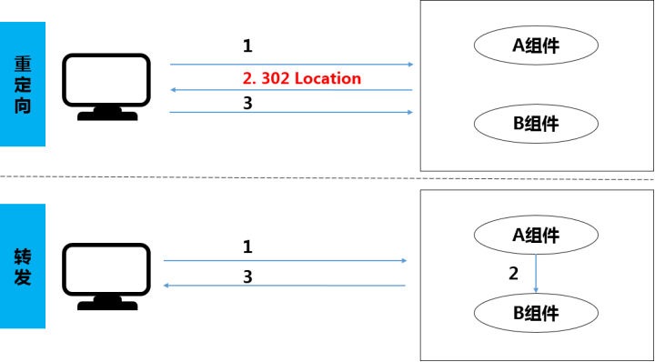
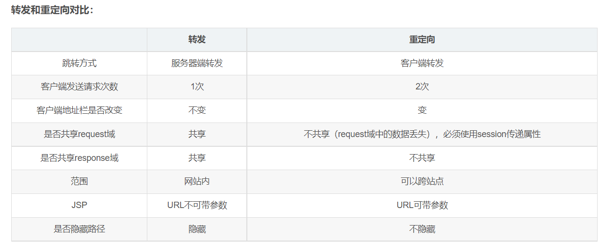
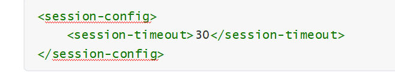

# 第四阶段JAVAWEB Servlet核心技术下

## 1.1**Servlet+JDBC**应用（重点）（task02,demo01）

1. 使用JDBC技术访问数据库，常见功能如下：   

查询DB数据，然后生成显示页面，例如：列表显示功能。

接收请求参数，然后对DB操作，例如：注册、登录、修改密码等功能。

为了方便重用和便于维护等目的，经常会采用DAO（Data Access Object）模式对数据库操作进行独立封装。


|  |      |
| ------------------------------------------------------------ | ---- |
|                                                              |      |

 DAO工厂(工厂模式)

工厂类：封装了对象的创建细节，为调用者提供符合要求的对象。

主要过程： 首先需要一个modelUser类，来模拟用户，使其每一个用户成为一个对象，采用UserDao层对数据库的相关操作进行独立的包装，然后dbutil类是为了存放与数据库连接的相关配置，在RegisterServlet中来整合所有的操作，使其完善。

## **1.2** **重定向和转发（重点）**(task02 demo02)

### 1.2.1 **重定向的概述**

#### **（1）** **重定向的概念**

首先客户浏览器发送http请求，当web服务器接受后发送302状态码响应及对应新的location给客 户浏览器，客户浏览器发现是302响应，则自动再发送一个新的http请求，请求url是新的location 地址，服务器根据此请求寻找资源并发送给客户。（通俗理解就是重新指定方向，也就是本来要请求A，但现在又要请求B了）（你找我借钱，我没钱，我告诉你去找别人，然后你自己找别人）

#### **（2）** **重定向的实现**

实现重定向需要借助javax.servlet.http.HttpServletResponse接口中的以下方法：

 

| **方法声明**                       | **功能介绍**                                      |
| ---------------------------------- | ------------------------------------------------- |
| void sendRedirect(String location) | 使用指定的重定向位置URL向客户端发送临时重定向响应 |

#### **（3）** **重定向的原理**


|  |      |
| ------------------------------------------------------------ | ---- |
|                                                              |      |

####  （4） **重定向的特点**

重定向之后，浏览器地址栏的URL（地址）会发生改变。

重定向过程中会将前面Request对象销毁，然后创建一个新的Request对象。

重定向的URL可以是其它项目工程。例如直接重定向到百度


### **1.2.2 **转发的概述

#### **（1）** **转发的概念**

一个Web组件（Servlet/JSP）将未完成的处理通过容器转交给另外一个Web组件继续处理，转发 的各个组件会共享Request和Response对象。（你找我借钱，我没钱，我直接找别人，让别人处理，别人给你钱）

#### **（2）** **转发的实现**

绑定数据到Request对象

| **方法声明**                            | **功能介绍**                                               |
| --------------------------------------- | ---------------------------------------------------------- |
| Object getAttribute(String name)        | 将指定属性值作为对象返回，若给定名称属性不存在，则返回空值 |
| void setAttribute(String name,Object o) | 在此请求中存储属性值                                       |

获取转发器对象

| **方法声明**                                                 | **功能介绍**                                                 |
| ------------------------------------------------------------ | ------------------------------------------------------------ |
| RequestDispatcher （获取一个调度器）getRequestDispatcher(String path) | 返回一个RequestDispatcher对象，该对象充当位于给定路径上的资源的包装器 |

转发操作

| **方法声明**                                                 | **功能介绍**                                                 |
| ------------------------------------------------------------ | ------------------------------------------------------------ |
| void forward(ServletRequest request, ServletResponse response) | 将请求从一个servlet转发到服务器上的另一个资源（Servlet、JSP文件或HTML文件） |

#### **（3）** **转发的特点**

转发之后浏览器地址栏的URL不会发生改变。转发过程中共享Request对象。

转发的URL不可以是其它项目工程。

#### **（4）** **重定向和转发的比较**


## 




## 1.3**Servlet**线程安全（重点）


服务器在收到请求之后，会启动一个线程来进行相应的请求处理。

默认情况下，服务器为每个Servlet只创建一个对象实例。当多个请求访问同一个Servlet时，会有 多个线程访问同一个Servlet对象，此时就可能发生线程安全问题。

多线程并发逻辑，需要使用synchronized对代码加锁处理，但尽量避免使用。

代码如下：（使用的是加锁的方式，如果不用加锁方式，可以将name设置成局部变量）

```
public class ThreadServlet extends HttpServlet {
    private String name;//准备一个成员变量

    protected void doPost(HttpServletRequest request, HttpServletResponse response) throws ServletException, IOException {
        synchronized (this) {
            //1.获取request对象中名字为name的参数值，并赋值给成员变量
            String name = request.getParameter("name");
            System.out.println("获取到的name数值为：" + name);
            //2.睡眠5s
            try {
                Thread.sleep(5000);
            } catch (InterruptedException e) {
                e.printStackTrace();
            }
            //3.使用打印流，将name数值发送给浏览器
            PrintWriter writer = response.getWriter();
            writer.write("<h1>" + name + "<h1>");

        }
    }

    protected void doGet(HttpServletRequest request, HttpServletResponse response) throws ServletException, IOException {
this.doPost(request, response);
    }
}
```

 

```
<!DOCTYPE html>
<html lang="en">
<head>
    <meta charset="UTF-8">
    <title>Thread线程安全的测试</title>
</head>
<body>
<iframe width="600px" height="100px" src="thread?name=zhangfei"></iframe><br>
<iframe width="600px" height="100px" src="thread?name=guanyu"></iframe><br>
<iframe width="600px" height="100px" src="thread?name=liubei"></iframe><br>
</body>
</html>
```

## **1.4** **状态管理（重点）**


- Web程序基于HTTP协议通信，而HTTP协议是”无状态”的协议，一旦服务器响应完客户的请求之 后，就断开连接，而同一个客户的下一次请求又会重新建立网络连接。
- 服务器程序有时是需要判断是否为同一个客户发出的请求，比如客户的多次选购商品。因此，有必  要跟踪同一个客户发出的一系列请求。
- 把浏览器与服务器之间多次交互作为一个整体，将多次交互所涉及的数据保存下来，即状态管理。 
-  多次交互的数据状态可以在客户端保存，也可以在服务器端保存。状态管理主要分为以下两类：

​               （1） 客户端管理：将状态保存在客户端（也就是浏览器）。基于Cookie技术实现。

​                （2） 服务器管理：将状态保存在服务器端。基于Session技术实现。

 

## 1.5 **Cookie**技术（重点）（客户端管理：将状态保存在客户端（也就是浏览器））


### **1.5.1** **基本概念**（理解为通行证）

Cookie本意为”饼干“的含义，在这里表示客户端以“名-值”形式进行保存的一种技术。

浏览器向服务器发送请求时，服务器将数据以Set-Cookie消息头的方式响应给浏览器，然后浏览器 会将这些数据以文本文件的方式保存起来。

当浏览器再次访问服务器时，会将这些数据以Cookie消息头的方式发送给服务器。

### **1.5.2 **相关的方法


使用javax.servlet.http.Cookie类的构造方法实现Cookie的创建。

 

| **方法声明**                      | **功能介绍**             |
| --------------------------------- | ------------------------ |
| Cookie(String name, String value) | 根据参数指定数值构造对象 |

使用javax.servlet.http.HttpServletResponse接口的成员方法实现Cookie的添加。（如果继续换取，如果多次获取的cookie的值相等，那么在浏览器的内存中只有一个cookie，因为系统识别到当cookie值相等时，起到的是修改效果，所以真能看到一个）

 

| **方法声明**                  | **功能介绍**             |
| ----------------------------- | ------------------------ |
| void addCookie(Cookie cookie) | 添加参数指定的对象到响应 |

使用javax.servlet.http.HttpServletRequest接口的成员方法实现Cookie对象的获取。

 

| **方法声明**          | **功能介绍**                     |
| --------------------- | -------------------------------- |
| Cookie[] getCookies() | 返回此请求中包含的所有Cookie对象 |

使用javax.servlet.http.Cookie类的构造方法实现Cookie对象中属性的获取和修改。

 

| **方法声明**                   | **功能介绍**             |
| ------------------------------ | ------------------------ |
| String getName()               | 返回此Cookie对象中的名字 |
| String getValue()              | 返回此Cookie对象的数值   |
| void setValue(String newValue) | 设置Cookie的数值         |

### 1.5.3 **Cookie**的生命周期

默认情况下，浏览器会将Cookie信息保存在内存中，只要浏览器关闭，Cookie信息就会消失。

如果希望关闭浏览器后Cookie信息仍有效，可以通过Cookie类的成员方法实现。

 

| **方法声明**               | **功能介绍**                                                 |
| -------------------------- | ------------------------------------------------------------ |
| int getMaxAge()            | 返回cookie的最长使用期限（以秒为单位）（如果是负数，浏览器关闭后失效。如果是0表示马上失效） |
| void setMaxAge(int expiry) | 设置cookie的最长保留时间（秒）                               |

### 1.5.6 **Cookie**的路径问题

浏览器在访问服务器时，会比较Cookie的路径与请求路径是否匹配，**只有匹配的Cookie才会发送给服务器**。

)Cookie的默认路径等于添加这个Cookie信息时的组件路径，例如：/项目名/目录/add.do请求添加了一个Cookie信息，则该Cookie的路径是 /项目名/目录。

访问的请求地址必须符合Cookie的路径或者其子路径时，浏览器才会发送Cookie信息。

 

| **方法声明**             | **功能介绍**         |
| ------------------------ | -------------------- |
| void setPath(String uri) | 设置cookie的路径信息 |

### 1.5.7 *Cookie*的特点

Cookie技术不适合存储所有数据，程序员只用于存储少量、非敏感信息，原因如下：

将状态数据保存在浏览器端，不安全。

保存数据量有限制，大约4KB左右。

只能保存字符串信息。

可以通过浏览器设置为禁止使用。

 

## 1.6**Session**技术（重点）（服务器管理：将状态保存在服务器端）


### **1.6.1** **基本概念**（理解为用户信息表）

Session本意为"会话"的含义，是用来维护一个客户端和服务器关联的一种技术。

浏览器访问服务器时，服务器会为每一个浏览器都在服务器端的内存中分配一个空间，用于创建一  个Session对象，该对象有一个id属性且该值唯一，我们称为SessionId，并且服务器会将这个SessionId以Cookie方式发送给浏览器存储。

浏览器再次访问服务器时会将SessionId发送给服务器，服务器可以依据SessionId查找相对应的

Session对象

### **1.6.2** **相关的方法**


使用javax.servlet.http.HttpServletRequest接口的成员方法实现Session的获取。

 

| **方法声明**             | **功能介绍**                                        |
| ------------------------ | --------------------------------------------------- |
| HttpSession getSession() | 返回此请求关联的当前Session，若此请求没有则创建一个 |

使用javax.servlet.http.HttpSession接口的成员方法实现判断和获取。

 

| **方法声明**    | **功能介绍**              |
| --------------- | ------------------------- |
| boolean isNew() | 判断是否为新创建的Session |
| String getId()  | 获取Session的编号         |

使用javax.servlet.http.HttpSession接口的成员方法实现属性的管理。

 

| **方法声明**                                 | **功能介绍**                                                 |
| -------------------------------------------- | ------------------------------------------------------------ |
| Object getAttribute(String name)             | 返回在此会话中用指定名称绑定的对象，如果没有对象在该名称下绑定，则返回空值 |
| void setAttribute(String name, Object value) | 使用指定的名称将对象绑定到此会话                             |
| void removeAttribute(String name)            | 从此会话中删除与指定名称绑定的对象                           |

### 1.6.3 **Session**的生命周期

服务器会将空闲时间过长的Session对象自动清除掉，服务器默认 的超时限制一般是30分钟。

使用javax.servlet.http.HttpSession接口的成员方法实现失效实现的获取和设置。


| **方法声明**                              | **功能介绍** |
| ----------------------------------------- | ------------ |
| int getMaxInactiveInterval()              | 获取失效时间 |
| void setMaxInactiveInterval(int interval) | 设置失效时间 |

可以配置web.xml文件修改失效时间。


|  |      |
| ------------------------------------------------------------ | ---- |
|                                                              |      |

 区别：

cookie数据保存在客户端，session数据保存在服务端。

session
简单的说，当你登陆一个网站的时候，如果web服务器端使用的是session，那么所有的数据都保存在服务器上，客户端每次请求服务器的时候会发送当前会话sessionid，服务器根据当前sessionid判断相应的用户数据标志，以确定用户是否登陆或具有某种权限。由于数据是存储在服务器上面，所以你不能伪造。

cookie
sessionid是服务器和客户端连接时候随机分配的，如果浏览器使用的是cookie，那么所有数据都保存在浏览器端，比如你登陆以后，服务器设置了cookie用户名，那么当你再次请求服务器的时候，浏览器会将用户名一块发送给服务器，这些变量有一定的特殊标记。服务器会解释为cookie变量，所以只要不关闭浏览器，那么cookie变量一直是有效的，所以能够保证长时间不掉线。

如果你能够截获某个用户的cookie变量，然后伪造一个数据包发送过去，那么服务器还是 认为你是合法的。所以，使用cookie被攻击的可能性比较大。

如果cookie设置了有效值，那么cookie会保存到客户端的硬盘上，下次在访问网站的时候，浏览器先检查有没有cookie，如果有的话，读取cookie，然后发送给服务器。

所以你在机器上面保存了某个论坛cookie，有效期是一年，如果有人入侵你的机器，将你的cookie拷走，放在他机器下面，那么他登陆该网站的时候就是用你的身份登陆的。当然，伪造的时候需要注意，直接copy cookie文件到 cookie目录，浏览器是不认的，他有一个index.dat文件，存储了 cookie文件的建立时间，以及是否有修改，所以你必须先要有该网站的 cookie文件，并且要从保证时间上骗过浏览器


### 1.6.4 Session的特点

数据比较安全。（因为是在服务器端）

能够保存的数据类型丰富，而Cookie只能保存字符串。

能够保存更多的数据，而Cookie大约保存4KB。

数据保存在服务器端会占用服务器的内存空间，如果存储信息过多、用户量过大，会严重影响服务  器的性能。

 

